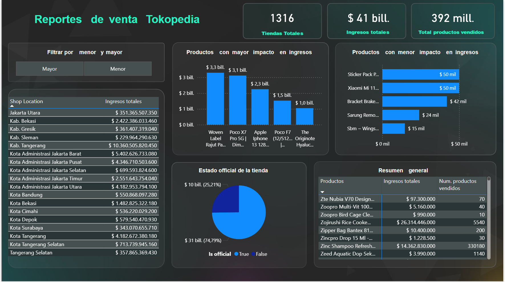

# 📊 Power BI Sales Dashboard – Tokopedia

## 📌 Project Overview
This project presents a sales analysis dashboard built in Power BI using Tokopedia data.
The goal is to identify products, brands, and store characteristics with the highest impact on total revenue.

## 🎯 Objectives
- Identify top-performing products by revenue
- Analyze products with the lowest revenue impact
- Compare official vs non-official stores
- Analyze revenue distribution by shop location

## 📈 Key KPIs
- Total Revenue
- Total Stores
- Total Products Sold

## 🛠 Tools Used
- Power BI
- DAX
- Data Modeling
- Data Visualization

## 📊 Dashboard Preview

## 💡 Key Insights
- A small group of products generates a large portion of total revenue
- Revenue is highly concentrated in top-performing products
- Official and non-official stores show different revenue distributions

## 📂 Files
- `tokopedia_sales_dashboard.pbix`: Power BI dashboard file
